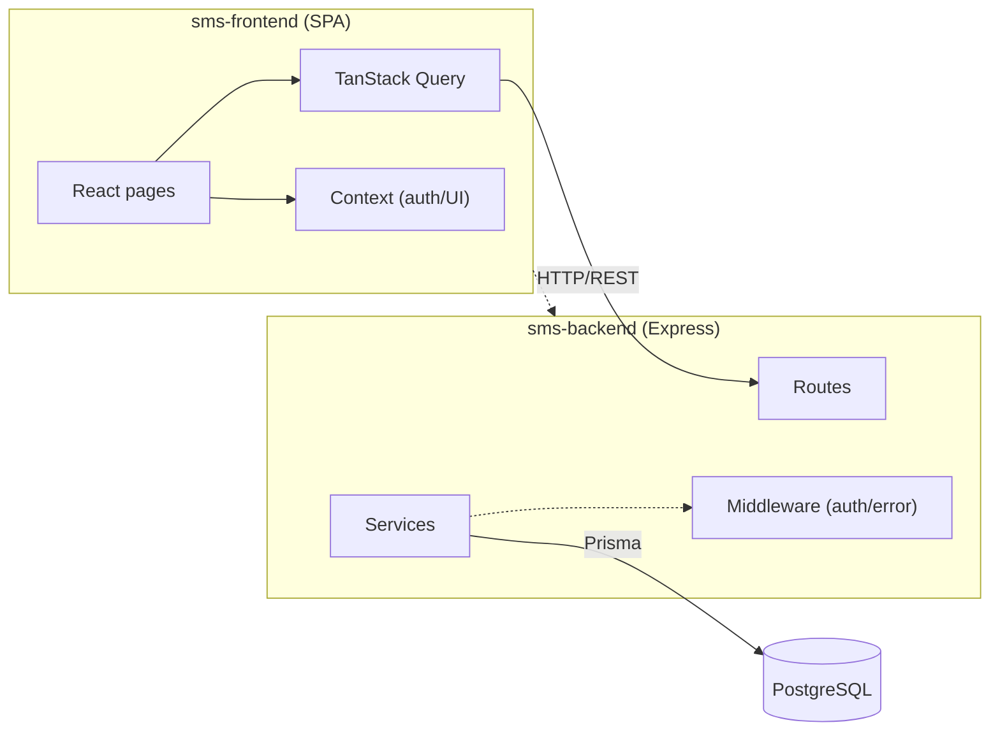

# Architecture Spine — Student Management System

## Design Paradigm

**REST API + SPA.** Client-server separation with a stateless REST backend and a single-page application frontend. The API is the single source of truth; the frontend caches server state via TanStack Query and holds no independent truth.

## Invariants & Rules

### AD-1 — Backend Framework: Express on Node.js

- **Binds:** backend services, API layer, middleware
- **Prevents:** framework fragmentation, inconsistent request handling
- **Rule:** All backend code runs on Express (Node.js) with TypeScript. No other HTTP framework is introduced.

### AD-2 — Frontend Framework: React 19 + Vite 6

- **Binds:** all UI, SPA routing, component tree
- **Prevents:** framework churn, inconsistent rendering patterns
- **Rule:** The SPA is built with React 19, Vite 6, TypeScript. Routing via React Router. No other UI framework is introduced.

### AD-3 — Database: PostgreSQL + Prisma ORM

- **Binds:** all persistence, schema evolution, data access
- **Prevents:** schema drift, ORM churn, multi-database fragmentation
- **Rule:** PostgreSQL is the sole database. Prisma schema is the source of truth; `prisma migrate` generates SQL. No raw SQL migrations. No other ORM or database is introduced.

### AD-4 — Authentication: JWT via HTTP-only Cookies

- **Binds:** all authenticated endpoints, session management, login flow
- **Prevents:** token leakage, session store complexity, inconsistent auth patterns
- **Rule:** JWT tokens are stored in HTTP-only cookies. No localStorage/sessionStorage for tokens. Role-based access (teacher vs student) enforced on backend for every protected route. Stateless — no server-side session store.

### AD-5 — Server State: TanStack Query

- **Binds:** all frontend data fetching, caching, cache invalidation
- **Prevents:** stale data, inconsistent fetch patterns, redundant requests
- **Rule:** All server state is managed via TanStack Query. React Context is used only for auth/UI state (theme, modals). No global state store (Redux, Zustand) for server-derived data.

### AD-6 — Account Provisioning: Seeded Teacher, Manual Student Creation

- **Binds:** user creation flows, signup, onboarding
- **Prevents:** open registration, uncontrolled user creation, admin role creep
- **Rule:** Initial teacher account is created via seed script / env config. Teacher creates student accounts manually. No self-registration. No admin role. CSV import deferred to v2.

### AD-7 — Grading: Dual-Path

- **Binds:** exam/test grading, score entry, result disclosure
- **Prevents:** inconsistent grading workflows, premature answer disclosure
- **Rule:** Two grading paths: (1) Online exams — auto-score from per-question student answers (MCQ/TF have a single correct answer); teacher can override scores. (2) Manual per-student score entry for offline/other exams. Score aggregates per-question answers; finalize unlocks correct-answer disclosure (FR-13).

### AD-8 — Exam Lifecycle: Window-Based with Auto-Submit

- **Binds:** exam availability, start/submit logic, time enforcement
- **Prevents:** exam access outside window, indefinite sessions, missed submissions
- **Rule:** Availability window = scheduled start through deadline (start + allowance). Full duration once started. Warning + auto-submit on expiry. Exam not startable after closed. Submission is final — no re-take in v1.

### AD-9 — Offline Resilience: Deferred

- **Binds:** exam-taking reliability, answer persistence
- **Prevents:** data loss on brief disconnection
- **Rule:** Auto-save on each answer selection with retry on reconnect. No formal offline queue or offline resume in v1. PRD FR-20 offline-sync assumption downgraded to retry-on-reconnect only.

### AD-10 — Deployment: Docker-Compose

- **Binds:** local development, service orchestration, database provisioning
- **Prevents:** environment drift, "works on my machine", manual service setup
- **Rule:** docker-compose for reproducibility and portability. Single dev environment. PostgreSQL runs in container. Cloud hosting deferred until worthwhile.

### AD-11 — Separate Repositories

- **Binds:** frontend and backend codebases, build pipelines, deployments
- **Prevents:** monolith coupling, independent release cadence
- **Rule:** Two separate repositories: `sms-frontend` and `sms-backend`. Type sharing via shared TypeScript types package or manual sync. Each repo has independent build/test/deploy.

### AD-12 — Error Response Envelope

- **Binds:** all API error responses, frontend error handling
- **Prevents:** inconsistent error shapes, ad-hoc error parsing
- **Rule:** All API errors return a consistent JSON envelope: `{ "error": { "code": "STRING", "message": "STRING" } }`. HTTP status codes follow REST conventions (400 validation, 401 auth, 403 forbidden, 404 not found, 500 server). Frontend parses this envelope uniformly.

### AD-13 — Pagination Convention

- **Binds:** list endpoints (classes, students, exams, results)
- **Prevents:** unbounded response size, inconsistent list APIs
- **Rule:** All list endpoints return paginated results. Default page size: 20. Cursor-based pagination where datasets are large or time-ordered (exam lists); offset-based for small, bounded sets (student rosters). Response shape: `{ "data": [...], "pagination": { "total": N, "page": N, "pageSize": N } }`.

### AD-14 — Time Handling

- **Binds:** exam scheduling, availability windows, timestamps
- **Prevents:** timezone ambiguity, scheduling bugs
- **Rule:** All timestamps stored as UTC in the database. Exam windows and class schedules are timezone-aware at the API layer (store timezone alongside schedule). Frontend displays times in the user's local timezone.

### AD-15 — Result Ownership: Canonical Submission → Score

- **Binds:** exam submission, grading, results, correct-answer disclosure
- **Prevents:** two owners of one entity (ExamSubmission vs GradeRecord), un-integratable result views
- **Rule:** A single `Submission` entity owns the student's submitted answers and lifecycle (in-progress → submitted → graded). The `Score` is derived from and stored against the `Submission`; there is exactly one `Submission` per student per exam. Grading reads answers off the `Submission` and writes the `Score`. The student results view is a projection over `Submission` + `Score`, never an independent record.

### AD-16 — Shared Data Contract Between Repos

- **Binds:** the API/dto shapes crossing the repo boundary, answer shapes, exam/result payloads
- **Prevents:** clashing shared-data shapes (StudentAnswer flat JSON vs pre-computed QuestionScore), type mismatch caught only at integration
- **Rule:** A single published `sms-shared` types package (versioned) defines the DTO shapes both repos consume — including the student-answer shape and the score/result shapes. Any change to a shared shape lands in `sms-shared` first with a version bump; neither repo defines a cross-repo data shape locally.

### AD-17 — Question Entity and Management

- **Binds:** question types, question storage, question ownership in exams/tests
- **Prevents:** ad-hoc question data model, fragmented question ownership
- **Rule:** A `Question` entity lives in the backend, owned by the exam/test it belongs to (no question bank in v1). Question types are multiple-choice (with its options) or true/false. Each question has a single correct answer. API CRUD for questions goes through `sms-backend/routes/exams`.

### AD-18 — Exam Schedule Conflict Detection

- **Binds:** exam/test creation, scheduling integrity
- **Prevents:** overlapping exam windows for the same class silently accepted
- **Rule:** Exam/test creation validates the new window (date/time/duration + timezone) against existing exams/tests for the same class. Overlap returns a 409 conflict with the conflicting exam; the exam is not saved. This check runs in the backend service layer (AD-1), not only in the frontend.

### AD-19 — Absent Student Marking

- **Binds:** grading flow, student result status
- **Prevents:** absent students being graded or left ambiguous
- **Rule:** In a grading context, a student can be marked `absent` for an exam/test. Absent removes them from the score-entry input and sets the result status to `absent`. Absent is a property of the `Submission`/`Score` record (AD-15), not a separate entity.

### AD-20 — Schedule Model

- **Binds:** class schedules, teacher daily overview, student schedule
- **Prevents:** schedule stored ad-hoc across classes, un-queryable daily views
- **Rule:** A class's `Schedule` models its recurring day/time slots (e.g. Biology on Mon/Wed 09:00). Teacher and student dashboards query these slots for a given day. A `Schedule` belongs to a `Class` and is the source for FR-1 and FR-15.

## Consistency Conventions

| Concern | Convention |
| --- | --- |
| Naming (entities, files) | Entities: PascalCase (Student, Exam). Files: kebab-case. DB tables: snake_case (prisma convention). |
| Data & formats (ids, dates, error shapes) | IDs: UUID (generated by Prisma). Dates: ISO 8601 UTC strings in API. Errors: AD-12 envelope. |
| State & cross-cutting | Auth: AD-4. Errors: AD-12. Logging: structured JSON on backend. Config: env vars, no hardcoded secrets. |

## Stack

| Name | Version |
| --- | --- |
| Node.js | 24 LTS |
| TypeScript | 7.x |
| Express | 5.x |
| Prisma | 7.x |
| PostgreSQL | 18 |
| React | 19.x |
| Vite | 8.x |
| React Router | 8.x |
| TanStack Query | 5.x |
| Vitest | 4.x |
| React Testing Library | 16.x |
| Docker / docker-compose | latest |

## Structural Seed



_Note: `sms-shared` is the versioned types package both repos consume (AD-16); the dotted line marks the repository boundary, not a runtime dependency direction.

```text
sms-backend/
  src/
    routes/       # API route handlers (express)
    middleware/    # auth, validation, error handler
    services/     # business logic (grading, exam lifecycle)
    prisma/       # schema.prisma, migrations
  tests/

sms-frontend/
  src/
    components/   # reusable UI components
    pages/        # route-level views (teacher, student)
    hooks/        # custom hooks (useAuth, useQuery wrappers)
    api/          # API client functions (TanStack Query hooks live here)
  tests/
```

## Capability → Architecture Map

| Capability | Lives in | Governed by |
| --- | --- | --- |
| Teacher Dashboard (FR-1, FR-2) | sms-frontend/pages/teacher | AD-2, AD-5, AD-20 |
| Class Management (FR-3, FR-4) | sms-frontend + sms-backend/routes/classes | AD-1, AD-2, AD-3 |
| Student Profile (FR-5) | sms-backend/routes/students + sms-frontend | AD-1, AD-3, AD-15 |
| Exam/Test Creation & Timetable (FR-6, FR-9) | sms-backend/routes/exams | AD-1, AD-8, AD-18 |
| Exam Conflict Detection (FR-7) | sms-backend/services | AD-18 |
| Question Management (FR-8) | sms-backend/routes/exams (Question) | AD-17 |
| Grading Input & Absent (FR-10, FR-11, FR-12) | sms-backend/services/grading | AD-7, AD-19, AD-15 |
| Finalize & Disclosure (FR-13) | sms-backend/services/grading | AD-7 |
| Student Dashboard & Schedule (FR-14, FR-15, FR-16) | sms-frontend/pages/student | AD-2, AD-5, AD-20 |
| Exam Taking (FR-17–FR-20) | sms-frontend/pages/student/exam + sms-backend | AD-2, AD-8, AD-9, AD-15 |
| Results (FR-21, FR-22) | sms-frontend + sms-backend/routes/results | AD-2, AD-7, AD-15 |
| Authentication (FR-23, FR-24) | sms-backend/middleware/auth + sms-frontend/hooks | AD-4 |

## Deferred

- **Offline queue / resume** — retry-on-reconnect covers v1; formal offline support deferred to v2.
- **Cloud hosting** — docker-compose covers local dev; deployment target deferred.
- **CSV import for students** — manual creation only in v1.
- **Question bank / reuse** — each exam owns its questions; cross-exam reuse deferred.
- **Essay/free-text/fill-in-blank question types** — MCQ and TF only in v1.
- **Notifications (email/push)** — in-app results only; push deferred.
- **Multi-school support** — single-school scope in v1.
